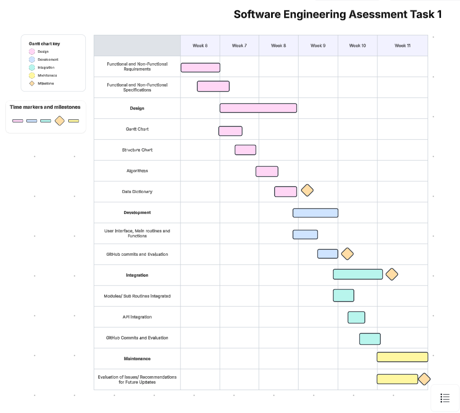
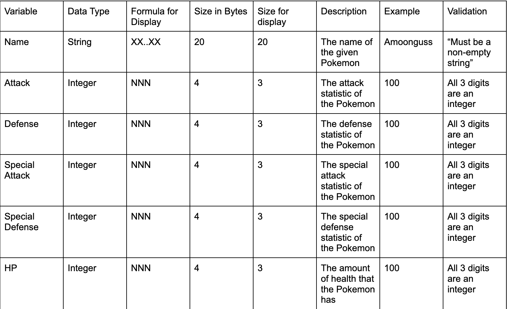
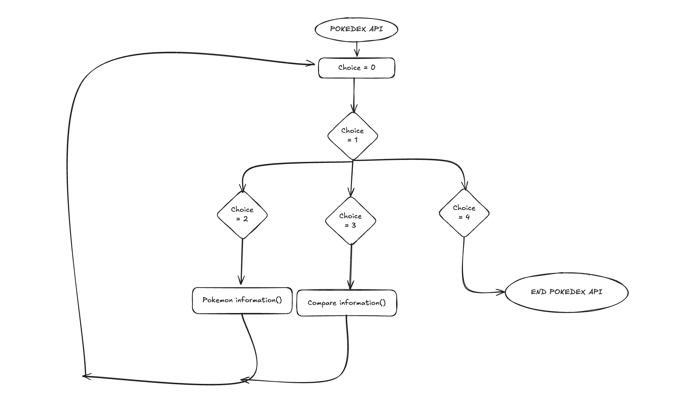
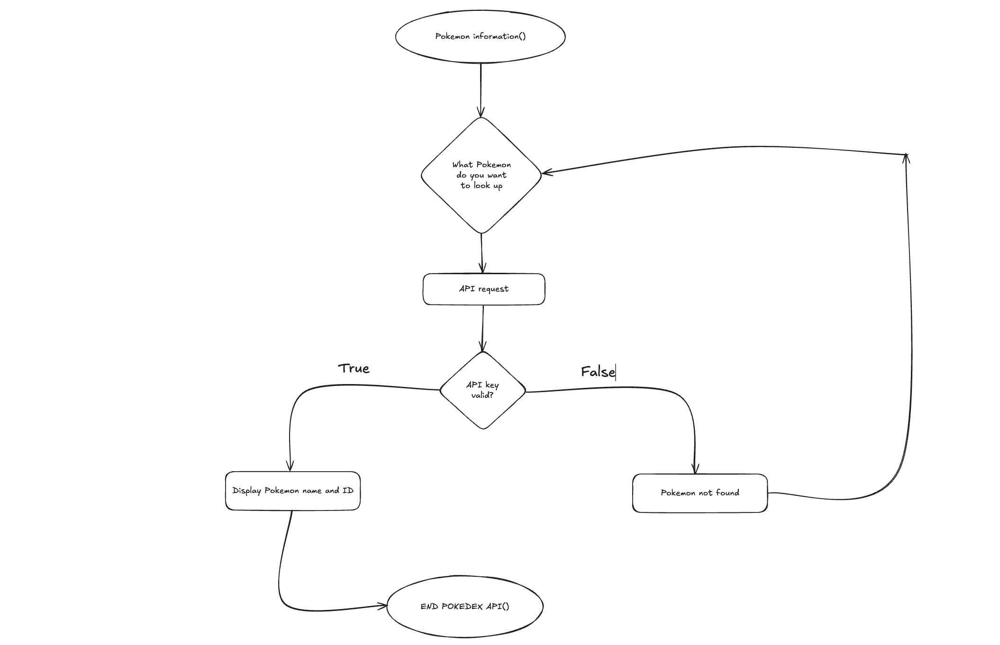
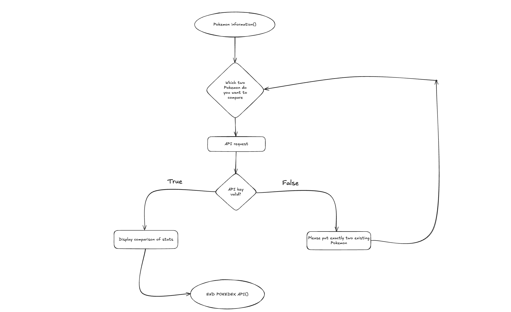

# 11 ASE Task 1 - Data Science Project

# Requirements Definition
## Functional Requirements
* Data Retrieval
    * Provides user with Pokemon name and pokedex number when searched
* User Interface
    * To interact with the system, the user must first add a Pokemon to their team, after this the user can remove the Pokemon and if another is added, then the user can compare 2 Pokemons stats side by side
* Data Display
    * The user needs to obtain the name of the Pokemon searched, their Pokedex number, their statistics and then be able to add and remove the Pokemon from their team. The user must also be able to compare two Pokemons stats together

## Non-Functional requirements
* Performance
    * The system must work and perform well, in line with the users needs
* Reliability
    * The system and data must be accurate to what the user inputted
* Usability and Accesibility
    * The system must be easily understood by the user, instructions must clearly point the user towards the system

### Functional Specfications
* User Requirements
    * The user needs to be able to look up a Pokemon and get its name, stats and pokedex number, the user must then be able to add and remove it to their team.
* Inputs and Outputs
    * The system must accept the users input (The name of the Pokemon) and output the statistics, name and pokedex number of the Pokemon
* Core Features
    * The system needs to add the Pokemons data to a json file
    * The system needs to display the options that th user can choose from using tkinter
* User Interaction
    * To ineteract with the system, users would need to run the code and then choose whether they want to add or remove pokemon from their team or if they want to compare their stats. To help users navigate the system, the program must clearly display what each button does so that the user does not get confused.
* Error Handling
    * One potential error that the user could face is API-retrieval crash which would prevent the user from properly navigating the system

### Non-Functional Specifications
* Performance
    * The Performance of this system should not be too slow in order to maintain user engagement. To ensure this program is efficient, it must have the correct data and display it well.
* Useability and Accesibility
    * To make my application more accesible, aspects such as speed or efficieny in the UI could be increased which would help the user to better access and use the system.
* Reliability
    * If the user happens to encounter an API-retrieval crash, it would fail to recieve the necessary details which would deem the code faulty and not working

## Use Cases
* Actors: the system coud be interacted with by fans of the Pokemon games or shows
* Preconditions: Internet access, API access
* Main flow:
1. Search Pokemon: The user enters a Pokemons name and the system retrieves it and its details
2. Store Pokemon: User adds the Pokemon to their team and the system confirms the storage
3. Compare Pokemon: The user needs to choose two Pokemon and the system retrives them and compares their stats
4. Visualise Data: The system displays the two Pokemons stats
5. Remove Pokemon: The user selects a Pokemon to remove from their team
* Postconditions: Pokemon data is successfully retrieved, stored, compared, visualised and potentially removed

# Maintenance
1. To handle issues caused by the API, I would revisit the link and fix thing sin my code while documenting my process.
2. To ensure that my program is maintained weel, I would have the user make sure that their Python is up to date and the newest version available. This needs to be done so that all the libraries the user requires work well and are reliable.
3. To fix a bug I would make sure that the users Python and its libraries are up to date. If the code still didn't work, I would personally look through it myself while documenting my process for potential future bugs.
4. I would document all of my progress to see how things might change in future updates of Python and the libraries.

# Final Evaluation
1. My program runs fairly well when compared to the initial fucntional and non functional requirements. My code successfully fulfilled the quota which was to add a Pokemon to the users team by searching up its name, then, if another Pokemon is added, compare their stats side by side. The option to remove a Pokemon was also implemented. In addition to what I initially put down for my requirements, I also added a help tab which tells the user what each button does to make navigation of my code easier. I believe that I successfully fulfilled the needed requirements.

2. To improve the code, you could make error messages more user-friendly instead of just printing them to the console. Handling missing data with fallback options would keep the UI smooth. Adding scrollable lists or pagination would help manage bigger teams, and a fuzzy search would make the Pokémon search more forgiving. Showing extra details like abilities, types, or images alongside stats would make the app feel richer. Finally, a backup/restore feature would give users more control and prevent data loss.

3. I believe that I managed this project and its development well for my first Preliminary Asessment Task. I could've managed my time a bit better as I waited until I was finished with my code to do most of the design. I did not directly follow the task guide but at the end I completed the necessary aspects which made my code work successfully. Some challenges that I encountered during my work were pamdas not working. To bypass this, I instead used another function which worked well but not as good as it could've been. Another challenge I encouneterd was receiving a bad outlook on the code from a peer which set me back a biy, but I eventually fixed the issue that they were highlighting.

## Peer Evaluation
* Ario - This code is very well executed and the features are easy to understand. The opening is very clear and accurately helps the user to navigate the code. To improve, you could add extra elements such as the Pokemons moves and level. In conclusion, this program could do with some tweaks but all in all, it is very well developed but also has room for improvement. 

# Pseudocode

BEGIN POKEDEXAPI ()
    choice = 0
    WHILE choice = 1
        pokemoninformation()
    WHILE choice = 2
        comparepokemon()
    WHILE coice = 3
        removepokemon()
pokemoninformation()
    IF API request valid THAN
            CONTINUE
        User choice = 0

        search for pokemon stats()
            User choice = 0
            If user choice = 1 THAN
                display name and id:
            ELSE add object to list
                ASK object
comparepokemon()
    IF API Request valid THAN
            CONTINUE
    ASK what pokemon the user wants to compare:
removepokemon()
    IF API Request invalid THAN
            SHOW WARNING
    IF API Request  valid  THAN
        REMOVE pokemon
END POKEDEXAPI()
    
