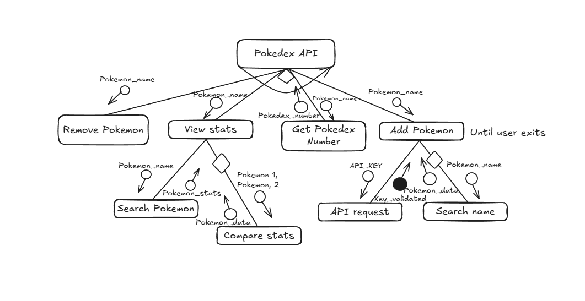

# 11 ASE Task 1 - Data Science Project

# Requirements Definition
## Functional Requirements
* Data Retrieval
    * Provides user with Pokemon name and pokedex number when searched
* User Interface
    * To interact with the system, the user must write a Pokemons name or Pokedex number
* Data Display
    * The user needs to obtain the name of the Pokemon searched, their Pokedex number, their statistics and then be able to add and remove the Pokemon from their team

## Non-Functional requirements
* Performance
    * The system must work and perform well, in line with the users needs
* Reliability
    * The system and data must be accurate to what the user inputted
* Usability and Accesibility
    * The system must be easily understood by the user, instructions must clearly point the user towards the system

### Functional Specfications
* User Requirements
    * The user needs to be able to look up a Pokemon and get its name, stats and pokedex number, the user must then be able to add and remove it to their team
* Inputs and Outputs
    * The system must accept the users input (The name of the Pokemon) and output the statistics, name and pokedex number of the Pokemon
* Core Features
    * The system needs to add the Pokemons data to a csv file
    * The system needs
* User Interaction
    * 
* Error Handling
    * 

### Non-Functional Specifications
* Performance
    * The Performance of this system should not be too slow in order to maintain user engagement. To ensure this program is efficient, it must have the correct data and display it well.
* Useability and Accesibility
* Reliability

