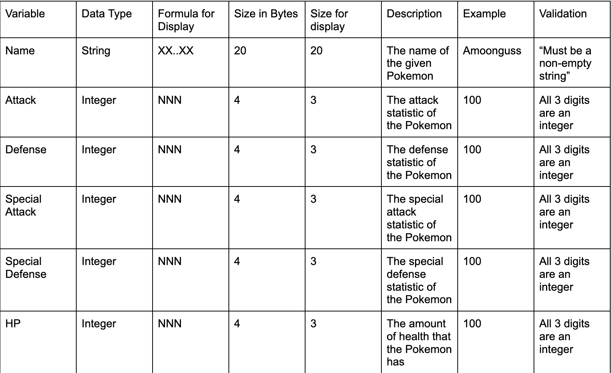

# 11 ASE Task 1 - Data Science Project

# Requirements Definition
## Functional Requirements
* Data Retrieval
    * Provides user with Pokemon name and pokedex number when searched
* User Interface
    * To interact with the system, the user must write a Pokemons name or Pokedex number
* Data Display
    * The user needs to obtain the name of the Pokemon searched, their Pokedex number, their statistics and then be able to add and remove the Pokemon from their team

## Non-Functional requirements
* Performance
    * The system must work and perform well, in line with the users needs
* Reliability
    * The system and data must be accurate to what the user inputted
* Usability and Accesibility
    * The system must be easily understood by the user, instructions must clearly point the user towards the system

### Functional Specfications
* User Requirements
    * The user needs to be able to look up a Pokemon and get its name, stats and pokedex number, the user must then be able to add and remove it to their team.
* Inputs and Outputs
    * The system must accept the users input (The name of the Pokemon) and output the statistics, name and pokedex number of the Pokemon
* Core Features
    * The system needs to add the Pokemons data to a json file
    * The system needs to display the options that th user can choose from using tkinter
* User Interaction
    * To ineteract with the system, users would need to run the code and then choose whether they want to add or remove pokemon from their team or if they want to compare their stats. To help users navigate the system, the program must clearly display what each button does so that the user does not get confused.
* Error Handling
    * One potential error that the user could face is API-retrieval crash which would prevent the user from properly navigating the system

### Non-Functional Specifications
* Performance
    * The Performance of this system should not be too slow in order to maintain user engagement. To ensure this program is efficient, it must have the correct data and display it well.
* Useability and Accesibility
    * To make my application more accesible, aspects such as speed or efficieny in the UI could be increased which would help the user to better access and use the system.
* Reliability
    * If the user happens to encounter an API-retrieval crash, it would fail to recieve the necessary details which would deem the code faulty and not working

## Use Cases
* Actors: the system coud be interacted with by fans of the Pokemon games or shows
* Preconditions: Internet access, API access
* Main flow:
1. Search Pokemon: The user enters a Pokemons name and the system retrieves it and its details
2. Store Pokemon: User adds the Pokemon to their team and the system confirms the storage
3. Compare Pokemon: The user needs to choose two Pokemon and the system retrives them and compares their stats
4. Visualise Data: The system displays the two Pokemons stats
5. Remove Pokemon: The user selects a Pokemon to remove from their team
* Postconditions: Pokemon data is successfully retrieved, stored, compared, visualised and potentially removed

